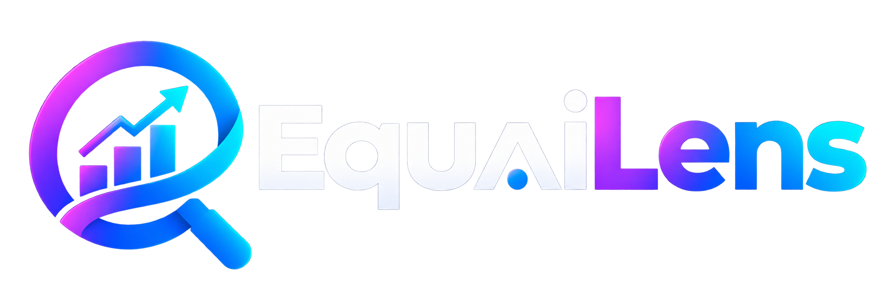

# EquAiLens 📈

**EquAiLens** is a full-stack, AI-powered equity research platform that automates the end-to-end workflow of financial analysis — from raw data collection and document parsing to AI-driven research report generation with source citations.

Unlike simple AI chatbots, EquAiLens uses an **Agentic Workflow** (powered by **LangGraph**) that autonomously fetches multi-market financial data, downloads native SEC/BSE filings, aggregates global news, and uses **Retrieval-Augmented Generation (RAG)** to ground every piece of analysis in verifiable fact.



---

## 📑 Table of Contents

- [Features](#-features)
- [Architecture Overview](#-architecture-overview)
- [Tech Stack](#️-tech-stack)
- [Project Structure](#-project-structure)
- [Local Development Setup](#️-local-development-setup)
- [API Endpoints](#-api-endpoints)
- [How the AI Works](#-how-the-ai-works)
- [Screenshots](#-screenshots)
- [Disclaimer](#️-disclaimer)
- [License](#-license)

---

## 🚀 Features

### 📊 Financial Data & Market Analysis
- **Real-time Market Snapshots**: Live price, volume, market cap, P/E, EPS, 52-week range, and more via Yahoo Finance.
- **Historical Price Charts**: Customizable candlestick and line charts with multiple time ranges (1W, 1M, 3M, 6M, 1Y, 5Y).
- **Deterministic Financial Engine**: Calculates 40+ financial ratios across profitability, liquidity, solvency, efficiency, growth, cashflow, and valuation categories.

### 📂 Multi-Market Document Ingestion
- **SEC EDGAR (US Market)**: Automatically fetches and downloads 10-K (Annual) and 10-Q (Quarterly) filings for any US-listed company.
- **BSE India (Indian Market)**: Downloads annual reports, quarterly results, and corporate announcements directly from the Bombay Stock Exchange.
- **Unified Documents Hub**: All fetched documents (PDFs, HTMLs) are stored in a local vault and indexed for immediate RAG ingestion.

### 🤖 AI-Powered Research
- **Agentic Research Pipeline (LangGraph)**: A multi-node graph that autonomously plans research, gathers evidence from documents, computes financial ratios, fetches news, and synthesizes a structured report.
- **RAG-Based Q&A**: Ask any question about a company's financials. The system retrieves exact paragraphs from ingested documents and generates cited answers.
- **Claim Verification**: Extracts factual claims from AI-generated text and verifies them against source documents.
- **Structured Report Generation**: Produces Wall Street-style research reports with sections for Executive Summary, Business Overview, Financial Analysis, Growth Analysis, Risk Analysis, Valuation, and Investment Thesis.

### 📰 Live News Aggregation
- **Multi-Source News**: Aggregates financial news from Google News RSS, Bing News, and Yahoo Finance.
- **Company-Specific & Market-Wide**: Get news filtered by ticker or browse market-wide headlines for Indian and US markets.
- **Sentiment & Relevance Filtering**: News items are scored for relevance to the specific company being researched.

### ⚖️ Peer Comparison
- **Side-by-Side Analysis**: Compare two companies across market cap, P/E, EPS, revenue, profit margins, and more.
- **Visual Metric Cards**: Clean, dark-mode metric cards that highlight which company leads in each dimension.

### 🔐 Authentication
- **JWT-Based Auth**: Secure login/signup system with hashed passwords and token-based session management.
- **Protected Routes**: All research and document features are gated behind authentication.

---

## 🏛️ Architecture Overview

```
┌─────────────────────────────────────────────────────────────────┐
│                         React Frontend                          │
│  (Dashboard, Company, Documents, BSE, SEC, News, Compare, RAG) │
└──────────────────────────────┬──────────────────────────────────┘
                               │ HTTP / SSE
┌──────────────────────────────▼──────────────────────────────────┐
│                      FastAPI Backend (REST)                      │
│                                                                  │
│  ┌──────────┐  ┌──────────────┐  ┌──────────────┐               │
│  │ Connectors│  │   Services   │  │  LangGraph   │               │
│  │           │  │              │  │   Graphs     │               │
│  │• Yahoo Fin│  │• Data Service│  │              │               │
│  │• SEC EDGAR│  │• Doc Service │  │• Ingestion   │               │
│  │• BSE India│  │• BSE Service │  │• RAG Q&A     │               │
│  │• Finnhub  │  │• SEC Service │  │• Research    │               │
│  │• News Agg │  │              │  │              │               │
│  └─────┬─────┘  └──────┬───────┘  └──────┬───────┘               │
│        │               │                 │                       │
│  ┌─────▼───────────────▼─────────────────▼───────┐               │
│  │              Core Processing Layer             │               │
│  │                                                │               │
│  │  Ingestion (PDF/Text → Chunks)                 │               │
│  │  Embedding (OpenAI text-embedding-3-small)     │               │
│  │  Vector Store (Qdrant)                         │               │
│  │  Financial Engine (40+ Ratio Calculations)     │               │
│  │  Planner + Executor (Tool-based reasoning)     │               │
│  │  Verification (Claim extraction & checking)    │               │
│  └────────────────────────────────────────────────┘               │
└──────────────────────────────────────────────────────────────────┘
```

---

## 🛠️ Tech Stack

| Layer | Technology |
|-------|-----------|
| **Frontend** | React 18, Vite, React Router, Lucide Icons |
| **Styling** | Custom Vanilla CSS, Glassmorphism, Dark Mode |
| **Backend** | FastAPI, Uvicorn, Python 3.9+ |
| **AI / LLM** | OpenAI GPT-4, LangGraph, LangChain |
| **Embeddings** | OpenAI `text-embedding-3-small` |
| **Vector DB** | Qdrant (local or cloud) |
| **Data Sources** | Yahoo Finance, SEC EDGAR, BSE India, Finnhub, Google News RSS, Bing News |
| **Document Parsing** | PyMuPDF (fitz), pdfplumber, BeautifulSoup |
| **Database** | Peewee ORM (SQLite) |
| **Auth** | PyJWT, passlib (bcrypt) |
| **Export** | Markdown, python-docx (DOCX), fpdf2 (PDF) |

---

## 📁 Project Structure

```
equity-research-agent/
├── .env                          # Environment variables (API keys)
├── .gitignore
├── README.md
├── requirements.txt              # Root Python dependencies
│
├── backend/                      # FastAPI Backend
│   ├── main.py                   # FastAPI app entry point, CORS, auth routes
│   ├── requirements.txt          # Backend-specific dependencies
│   │
│   ├── api/
│   │   └── routes.py             # All REST API endpoints (company, market, docs, BSE, SEC, news, RAG, research)
│   │
│   ├── config/
│   │   └── settings.py           # Centralized configuration (API keys, model settings, paths)
│   │
│   ├── connectors/               # External data source integrations
│   │   ├── yahoo_finance.py      # Yahoo Finance connector (fundamentals, financials, history)
│   │   ├── sec_edgar.py          # SEC EDGAR connector (CIK resolution, filing download)
│   │   ├── bse.py                # BSE India connector (company search, filing fetch)
│   │   ├── market.py             # Market data aggregator (snapshots, price history)
│   │   ├── company.py            # Company info resolution
│   │   ├── finnhub.py            # Finnhub market data connector
│   │   ├── news_connector.py     # Unified news aggregation wrapper
│   │   └── news/                 # News sub-package
│   │       ├── main.py           # News API FastAPI sub-app
│   │       ├── service.py        # Multi-source news fetching (Google, Bing, Yahoo)
│   │       ├── rss.py            # RSS feed parser for Google News
│   │       ├── models.py         # News data models
│   │       └── universe.py       # Stock universe (ticker → company name mapping)
│   │
│   ├── schemas/                  # Pydantic models for API validation
│   │   ├── company.py            # CompanyOverview schema
│   │   ├── market.py             # MarketSnapshot, PriceHistory schemas
│   │   ├── document.py           # DocumentCollection, CollectionResult schemas
│   │   ├── answer.py             # RAGAnswer, AskRequest schemas
│   │   ├── research_report.py    # ResearchReport, ResearchRequest schemas
│   │   ├── bse.py                # BSE filing schemas (FetchOptions, CompanyFolder, etc.)
│   │   ├── sec.py                # SEC filing schemas (FetchOptions, CompanyHit)
│   │   ├── chunk.py              # Document chunk schemas
│   │   ├── embedding.py          # Embedding schemas
│   │   ├── plan.py               # Research plan schemas
│   │   └── retrieval.py          # Retrieval result schemas
│   │
│   ├── services/                 # Business logic layer
│   │   ├── data_service.py       # Company data orchestration
│   │   ├── document_service.py   # Document collection, ingestion, and management
│   │   ├── bse_service.py        # BSE filing ingestion logic
│   │   ├── bse_storage.py        # BSE file storage, manifest management
│   │   └── sec_service.py        # SEC filing ingestion logic
│   │
│   ├── graph/                    # LangGraph state machines
│   │   ├── state.py              # Shared graph state definitions
│   │   ├── ingestion_graph.py    # Document ingestion pipeline (parse → chunk → embed → store)
│   │   ├── rag_graph.py          # RAG Q&A pipeline (retrieve → build context → generate answer)
│   │   ├── research_graph.py     # Full research pipeline (plan → evidence → analyze → report)
│   │   └── checkpointer.py       # Graph state checkpointing
│   │
│   ├── ingestion/                # Document processing
│   │   ├── pdf_extractor.py      # PDF/HTML text extraction (PyMuPDF, pdfplumber)
│   │   ├── chunker.py            # Intelligent text chunking (semantic, sliding window)
│   │   └── text_cleaner.py       # Text normalization and cleaning
│   │
│   ├── embedding/                # Vector embedding generation
│   │   ├── embedder.py           # OpenAI embedding wrapper with batching
│   │   └── cache.py              # Embedding cache for deduplication
│   │
│   ├── vector_store/             # Vector database interface
│   │   └── qdrant_store.py       # Qdrant vector store (upsert, search, delete)
│   │
│   ├── retrieval/                # Document retrieval
│   │   └── retriever.py          # Semantic search retriever (query → relevant chunks)
│   │
│   ├── rag/                      # Retrieval-Augmented Generation
│   │   ├── orchestrator.py       # RAG pipeline orchestrator
│   │   ├── context_builder.py    # Context window assembly from retrieved chunks
│   │   ├── prompt_builder.py     # Dynamic prompt construction
│   │   └── confidence.py         # Answer confidence scoring
│   │
│   ├── financial_engine/         # Deterministic financial calculations
│   │   ├── engine.py             # Main engine (orchestrates all ratio categories)
│   │   ├── profitability.py      # Gross margin, net margin, ROE, ROA, ROIC
│   │   ├── liquidity.py          # Current ratio, quick ratio
│   │   ├── solvency.py           # Debt-to-equity, interest coverage
│   │   ├── efficiency.py         # Asset turnover, inventory turnover
│   │   ├── growth.py             # Revenue growth, earnings growth (YoY, CAGR)
│   │   ├── cashflow.py           # FCF yield, operating cash flow ratio
│   │   └── valuation.py          # P/E, P/B, P/S, EV/EBITDA, PEG ratio
│   │
│   ├── agents/                   # AI agent definitions
│   │   └── equity_analyst.py     # Main equity analyst agent (LLM-powered reasoning)
│   │
│   ├── planner/                  # Research planning & execution
│   │   ├── planner.py            # Research plan generation (what evidence to gather)
│   │   ├── executor.py           # Plan execution (tool calling, evidence assembly)
│   │   └── tool_registry.py      # Available tools for the planner
│   │
│   ├── verification/             # Fact-checking layer
│   │   ├── claim_extractor.py    # Extracts verifiable claims from generated text
│   │   └── verifier.py           # Verifies claims against source documents
│   │
│   ├── report/                   # Report generation
│   │   └── report_generator.py   # Assembles final structured research report
│   │
│   ├── prompts/                  # LLM prompt templates
│   │   ├── executive_summary.txt
│   │   ├── business_overview.txt
│   │   ├── financial_analysis.txt
│   │   ├── growth_analysis.txt
│   │   ├── risk_analysis.txt
│   │   ├── valuation_commentary.txt
│   │   ├── investment_thesis.txt
│   │   ├── rag_answer.txt
│   │   ├── report_system.txt
│   │   ├── compare.txt
│   │   └── summarize.txt
│   │
│   ├── models/                   # Database ORM models
│   │   ├── document.py           # Document metadata model
│   │   └── workspace.py          # User workspace model
│   │
│   ├── documents/                # Local document storage vault (auto-created)
│   ├── data/                     # SQLite databases
│   ├── reports/                  # Generated research reports
│   ├── logs/                     # Application logs
│   └── tests/                    # Backend test suite
│
├── frontend/                     # React Frontend (Vite)
│   ├── index.html                # HTML entry point
│   ├── package.json              # Node.js dependencies
│   ├── vite.config.js            # Vite configuration
│   │
│   └── src/
│       ├── main.jsx              # React entry point
│       ├── App.jsx               # Root component (routing, sidebar, layout)
│       ├── App.css               # App-specific styles
│       ├── index.css             # Global design system (dark theme, glassmorphism)
│       │
│       ├── assets/               # Static assets
│       │   ├── logo.png          # EquAiLens logo
│       │   └── logo_w.png        # White variant logo
│       │
│       ├── context/
│       │   └── AuthContext.jsx   # Authentication context provider (JWT)
│       │
│       ├── components/           # Reusable UI components
│       │   ├── Charts.jsx        # Recharts-based financial charts
│       │   ├── Chatbot.jsx       # RAG chatbot interface
│       │   ├── MarketDataGrid.jsx# Market data display grid
│       │   └── ReportViewer.jsx  # Research report viewer with export
│       │
│       └── pages/                # Application pages
│           ├── Auth.jsx          # Login / Signup page
│           ├── Dashboard.jsx     # Main dashboard with watchlist
│           ├── Company.jsx       # Full company workspace (data, charts, docs, research)
│           ├── CompanyOverview.jsx# Quick company lookup
│           ├── DocumentsHub.jsx  # Unified document management & ingestion
│           ├── BseScreener.jsx   # BSE India filing screener
│           ├── SecScreener.jsx   # SEC EDGAR filing screener
│           ├── NewsPage.jsx      # Live news aggregation page
│           ├── Compare.jsx       # Peer comparison page
│           ├── ResearchAssistant.jsx # AI research chat interface
│           └── AboutUs.jsx       # About page with project details
│
└── tests/                        # Integration / E2E tests
```

---

## ⚙️ Local Development Setup

### Prerequisites
- **Node.js** v18+
- **Python** 3.9+
- **OpenAI API Key** (for embeddings and LLM)
- **Qdrant** (local Docker instance or Qdrant Cloud)

### 1. Clone the Repository
```bash
git clone https://github.com/Aaditya210905/equity-research-agent.git
cd equity-research-agent
```

### 2. Setup Environment Variables
Create a `.env` file in the project root:
```env
OPENAI_API_KEY=your_openai_api_key
QDRANT_URL=http://localhost:6333
QDRANT_API_KEY=               # Leave empty for local Qdrant
FINNHUB_API_KEY=your_finnhub_key  # Optional
```

### 3. Setup the Backend
```bash
cd backend

# Create and activate virtual environment
python -m venv venv

# Windows
venv\Scripts\activate
# Mac/Linux
source venv/bin/activate

# Install dependencies
pip install -r ../requirements.txt

# Run the backend
uvicorn main:app --reload
```
The FastAPI backend will start on **http://localhost:8000**.

### 4. Setup the Frontend
Open a new terminal:
```bash
cd frontend

# Install dependencies
npm install

# Run the development server
npm run dev
```
The React frontend will start on **http://localhost:5173**.

### 5. Start Qdrant (Vector Database)
If running Qdrant locally with Docker:
```bash
docker run -p 6333:6333 qdrant/qdrant
```

---

## 📡 API Endpoints

### Company & Market Data
| Method | Endpoint | Description |
|--------|----------|-------------|
| `GET` | `/company/{ticker}` | Get company overview (name, sector, description) |
| `GET` | `/market/{ticker}` | Get real-time market snapshot |
| `GET` | `/market/{ticker}/history` | Get historical price data |

### Document Management
| Method | Endpoint | Description |
|--------|----------|-------------|
| `POST` | `/documents/{ticker}/collect` | Trigger document collection from all sources |
| `GET` | `/documents/{ticker}` | List all documents for a company |
| `GET` | `/documents/{ticker}/stream` | SSE stream for ingestion progress |

### BSE India Filings
| Method | Endpoint | Description |
|--------|----------|-------------|
| `GET` | `/bse/search` | Search BSE-listed companies |
| `POST` | `/bse/filings/fetch` | Fetch and download BSE filings |
| `GET` | `/bse/filings` | List all fetched BSE folders |
| `GET` | `/bse/file/{path}` | Serve a downloaded BSE PDF |

### SEC EDGAR Filings
| Method | Endpoint | Description |
|--------|----------|-------------|
| `GET` | `/sec/search` | Search US companies by ticker |
| `POST` | `/sec/filings/fetch` | Fetch and download SEC filings |
| `GET` | `/sec/filings` | List all fetched SEC folders |
| `GET` | `/sec/file/{path}` | Serve a downloaded SEC document |

### AI Research & RAG
| Method | Endpoint | Description |
|--------|----------|-------------|
| `POST` | `/ask` | Ask a question (RAG pipeline) |
| `POST` | `/ask/stream` | SSE stream for RAG answer |
| `POST` | `/research/{ticker}` | Generate a full research report |
| `GET` | `/research/{ticker}/stream` | SSE stream for research progress |

### News
| Method | Endpoint | Description |
|--------|----------|-------------|
| `GET` | `/news/{ticker}` | Get company-specific news |
| `GET` | `/news/market/{market}` | Get market-wide news (IN/US) |

---

## 🧠 How the AI Works

EquAiLens does **not** rely solely on pre-trained LLM knowledge. When you trigger a research report or ask a question:

### Step 1 — Planning
The **Planner** analyzes your query and determines what evidence is needed (financial data, document excerpts, news sentiment, ratio calculations).

### Step 2 — Evidence Gathering (Parallel)
LangGraph orchestrates parallel evidence collection:
- **Financial Data Node**: Fetches live market data and computes 40+ financial ratios.
- **Document RAG Node**: Performs semantic search over ingested filings to find exact relevant paragraphs.
- **News Node**: Aggregates recent news and sentiment.

### Step 3 — Analysis & Synthesis
The **Equity Analyst Agent** receives all gathered evidence and produces structured analysis sections, each grounded in the retrieved data.

### Step 4 — Verification
The **Claim Extractor** pulls out factual assertions from the generated text, and the **Verifier** cross-checks them against source documents.

### Step 5 — Report Assembly
The **Report Generator** assembles everything into a structured research report with:
- Executive Summary
- Business Overview
- Financial Analysis (with computed ratios)
- Growth Analysis
- Risk Assessment
- Valuation Commentary
- Investment Thesis
- Source Citations

---

## ⚠️ Disclaimer

**EQUAILENS** provides AI-generated financial research for **educational and informational purposes only**. It does not constitute investment, financial, or personalized advice, nor does it constitute a recommendation to buy, sell, or hold any security.

EQUAILENS does not assess an individual's financial circumstances, investment objectives, or risk tolerance. Users are responsible for their own investment decisions and should consult a qualified financial professional when personalized advice is required.

**Investments are subject to market risks, including the possible loss of principal. Past performance does not guarantee future results.**

---

## 📄 License

This project is open-source and available under the [MIT License](LICENSE).

---

<p align="center">
  <b>EquAiLens</b> — Research smarter. Verify the evidence. Decide for yourself.
</p>
